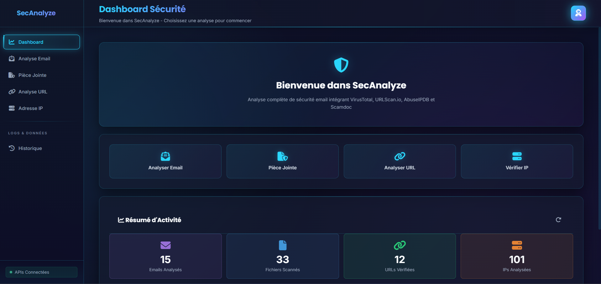
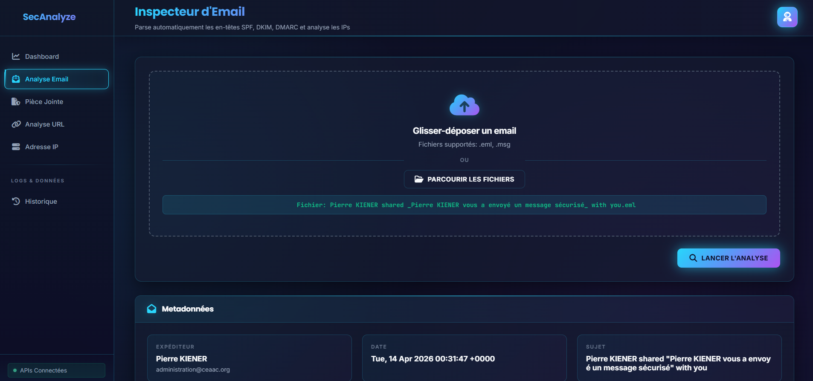
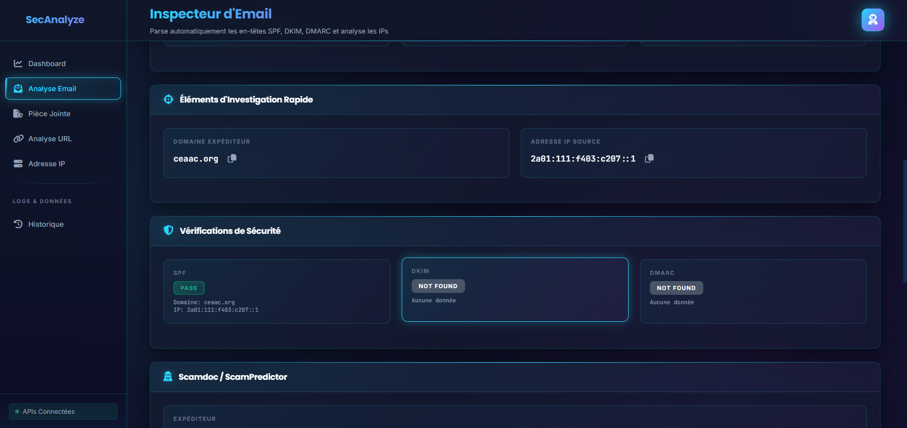
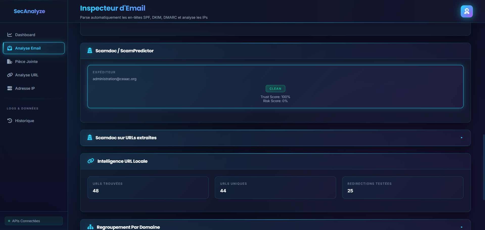
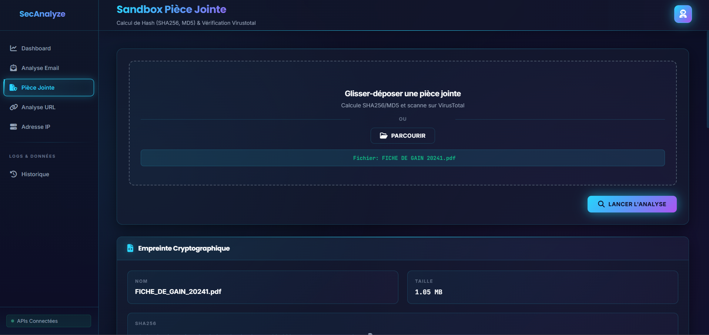
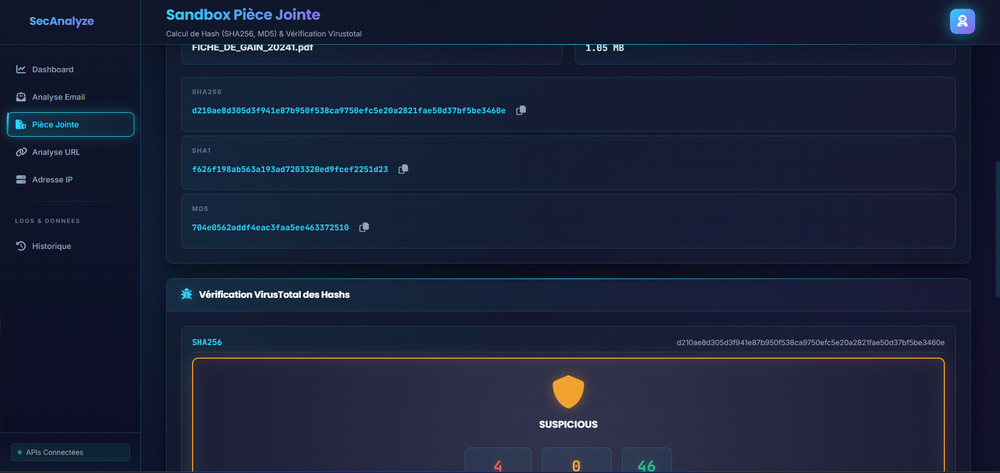
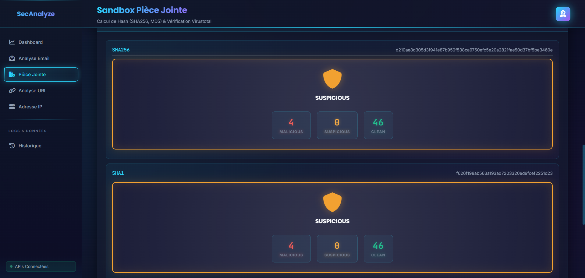
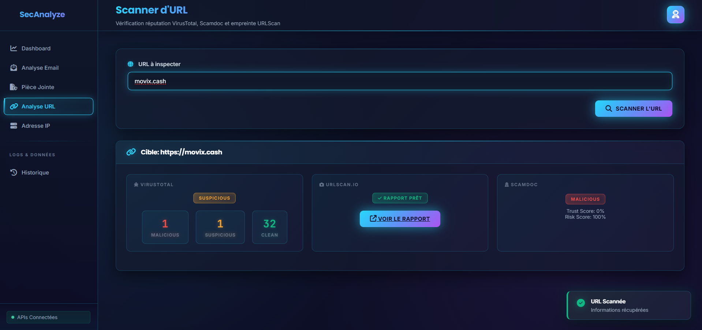
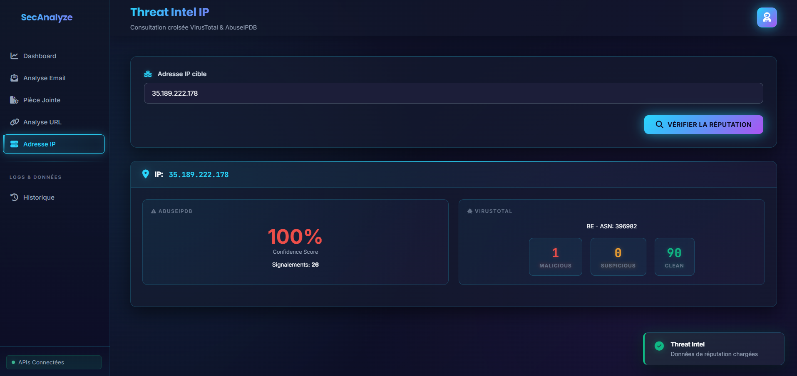
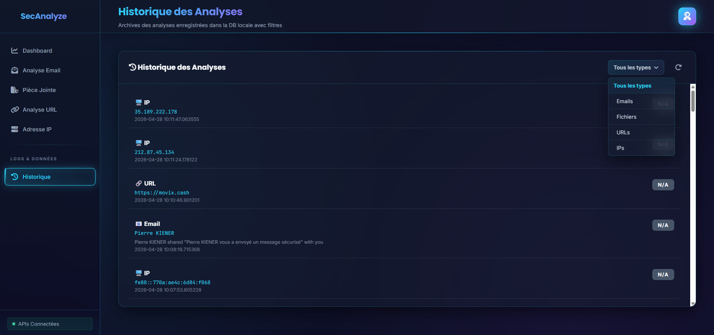

# Mail Security Analyzer 🔒

Outil d'analyse de sécurité email centralisé intégrant VirusTotal, URLScan.io, AbuseIPDB et Scamdoc (ScamPredictor via RapidAPI).

## Aperçu

### 📊 Dashboard Principal
<div align="center">
  
</div>

### 📧 Analyse d'Email
<div align="center">
  
  
  
</div>

### 📁 Analyse de Pièce Jointe
<div align="center">
  
  
  
</div>

### 🔗 Analyse d'URL
<div align="center">
  
</div>

### 🖥️ Analyse d'IP
<div align="center">
  
</div>

### 📜 Historique
<div align="center">
  
</div>

## 🎯 Fonctionnalités

- ✅ **Analyse d'email** : Parse entête SPF, DKIM, DMARC
- ✅ **Extraction d'informations** : IPs, domaines, en-têtes
- ✅ **Calcul de hash** : MD5, SHA1, SHA256
- ✅ **Analyse de pièces jointes** : Vérification VirusTotal
- ✅ **Analyse d'URLs** : Vérification VirusTotal + URLScan.io + Scamdoc
- ✅ **Analyse d'IPs** : VirusTotal + AbuseIPDB
- ✅ **Scoring Scamdoc** : Trust Score et Risk Score pour domaines/URLs
- ✅ **Base de données** : Cache local SQLite
- ✅ **Interface web** : Dashboard moderne et intuitif

## 📊 Architecture

```
mail-security-tool/
├── backend/
│   ├── config.py              # Configuration centralisée
│   ├── email_parser.py        # Parser d'entête email
│   ├── hash_calculator.py     # Calcul de hash
│   ├── api_clients.py         # Clients API (VT, URLScan, AbuseIPDB, Scamdoc)
│   ├── database.py            # Gestion SQLite
│   └── analyzer.py            # Orchestrateur principal
├── frontend/
│   ├── app.py                 # Serveur Flask
│   ├── templates/
│   │   └── index.html         # Interface web
│   └── static/
│       ├── style.css          # Styles
│       └── script.js          # JavaScript frontend
├── data/                       # Base de données
├── requirements.txt           # Dépendances Python
├── .env                       # Variables d'environnement
└── README.md                  # Ce fichier
```

## 🚀 Démarrage Rapide - Deux Options

### ✅ Option 1: Double-clic sur run.bat (Recommandé - Windows uniquement)

```
Double-cliquer sur: run.bat
```

C'est tout ! 🎉
- Crée automatiquement l'environnement virtuel
- Installe les dépendances
- Démarre le serveur Flask
- Accès: http://127.0.0.1:5000

### ✅ Option 2: Docker (Windows/Mac/Linux)

**Prérequis:** Docker Desktop installé

```powershell
# 1. Éditer .env avec tes clés API
copy .env.example .env

# 2. Démarrer
docker compose up --build -d

# 3. Ouvrir http://127.0.0.1:5000
```

---

## 🚀 Installation Détaillée (Si tu veux plus de contrôle)

### Prérequis
- Windows 10/11
- Python 3.8+
- pip

### Étapes Manuelles

1. **Télécharger le projet**
   ```powershell
   cd mail-security-tool
   ```

2. **Créer un environnement virtuel**
   ```powershell
   python -m venv venv
   ```

3. **Activer l'environnement virtuel**
   ```powershell
   .\venv\Scripts\Activate.ps1
   ```

4. **Installer les dépendances**
   ```powershell
   pip install -r requirements.txt
   ```

5. **Configurer les clés API**
   - Éditer le fichier `.env`
   - Ajouter tes clés API VirusTotal, URLScan.io, AbuseIPDB, Scamdoc (RapidAPI)

   **Obtenir les clés API :**
   - [VirusTotal](https://www.virustotal.com/gui/home/upload)
   - [URLScan.io](https://urlscan.io/)
   - [AbuseIPDB](https://www.abuseipdb.com/)
   - [ScamPredictor (RapidAPI)](https://rapidapi.com/)

6. **Lancer l'application**
   ```powershell
   python run.py
   ```

7. **Accéder à l'interface**
   - Ouvrir navigateur: `http://127.0.0.1:5000`

## 🐳 Pourquoi Docker ?

Docker est inclus pour exécuter l'application dans un environnement standardisé, sans dépendre de la configuration locale.

Avantages principaux:
- Même environnement pour tout le monde (version Python, dépendances, chemins)
- Démarrage rapide avec `docker compose up` (pas besoin d'installer manuellement toutes les libs)
- Isolation du projet (moins de conflits avec d'autres projets Python)
- Déploiement plus simple (comportement proche entre local et serveur)

Le stack Docker du projet:
- [mail-security-tool/Dockerfile](mail-security-tool/Dockerfile): construit l'image applicative
- [mail-security-tool/docker-compose.yml](mail-security-tool/docker-compose.yml): lance le service web, mappe le port `5000` et persiste `data/` et `uploads/`

## 📖 Utilisation

### 1. Analyse d'Email
- Charger un fichier `.eml` ou `.msg`
- Le système parse automatiquement:
  - En-têtes SPF, DKIM, DMARC
  - IPs et domaines
   - Vérifie les IPs sur VirusTotal et AbuseIPDB
   - Vérifie les domaines/URLs extraits via Scamdoc

#### Analyse des Routages (IPs)
Dans le rapport d'analyse email, la section **Analyse des Routages (IPs)** affiche le chemin technique du message à partir des en-têtes mail.

Pour chaque IP détectée, l'interface montre:
- L'adresse IP du serveur de passage/envoi
- Les statistiques VirusTotal (malicious/suspicious/clean)
- Les informations de contexte (pays, ASN)
- Le score AbuseIPDB (abuse confidence)

Cette section sert à repérer rapidement si un email a transité par une infrastructure suspecte (IP signalée, serveur compromis, relais douteux, etc.).

Note: ce n'est pas un traceroute réseau en direct. L'analyse est basée sur les en-têtes présents dans l'email reçu.

### 2. Analyse de Pièce Jointe
- Charger le fichier suspect
- Calcule: MD5, SHA1, SHA256
- Vérifie les hash sur VirusTotal
- Affiche le verdict (Malveillant/Suspect/Propre)

### 3. Analyse d'URL
- Entrer une URL
- Analyse via VirusTotal, URLScan.io et Scamdoc
- Affiche le verdict et les détails (dont Trust Score et Risk Score Scamdoc)

### 4. Analyse d'IP
- Entrer une adresse IP
- Vérifie sur VirusTotal et AbuseIPDB
- Affiche pays, ASN, score de confiance abus

## 🔧 Configuration Avancée

### Modifier le timeout API
```python
# backend/config.py
API_TIMEOUT = 15  # secondes
```

### Changer le chemin de la BD
```python
# backend/config.py
DB_PATH = "chemin/vers/ma/bdd.db"
```

### Rate Limiting
```python
# backend/config.py
VIRUSTOTAL_RATE_LIMIT = 4    # 4 req/min
URLSCAN_RATE_LIMIT = 1       # 1 req/s
ABUSEIPDB_RATE_LIMIT = 1     # 1 req/s
SCAMDOC_RATE_LIMIT = 1       # 1 req/s
```

## 📝 API Endpoints

### Email
```
POST /api/analyze/email
Body: multipart/form-data (file)
```

### Pièce Jointe
```
POST /api/analyze/attachment
Body: multipart/form-data (file)
```

### URL
```
POST /api/analyze/url
Body: {"url": "https://example.com"}
```

### IP
```
POST /api/analyze/ip
Body: {"ip": "8.8.8.8"}
```

### Historique
```
GET /api/history?limit=50
```

### Rapport
```
GET /api/report/<email_hash>
```

## 🔐 Sécurité

- ✅ Clés API dans `.env` (jamais en dur)
- ✅ Validation des fichiers uploadés
- ✅ Limite de taille (50MB)
- ✅ Validation des IPs/URLs
- ✅ CORS à configurer si nécessaire

## 🐛 Troubleshooting

### "API key not configured"
→ Vérifie ton fichier `.env`

### Erreur de timeout
→ Augmente `API_TIMEOUT` dans `config.py`

### Port 5000 déjà utilisé
```bash
python app.py --port 5001
```

## 📈 À améliorer

- [ ] Authentication utilisateur
- [ ] Export PDF/CSV des rapports
- [ ] Dashboard analytics
- [ ] Intégration Slack/Email pour alertes
- [ ] Support multi-threading
- [ ] Docker container
- [ ] Tests unitaires

## 📄 License

MIT

## 👥 Support

Pour des questions ou améliorations, n'hésite pas à me contacter !

---

**Dernière mise à jour:** Avril 2026
